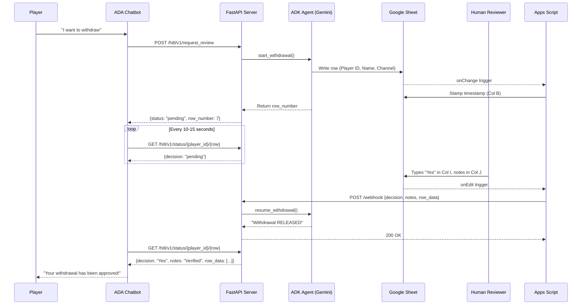

# HITL Payment Automation — Google ADK + FastAPI + Google Sheets

   

## Overview

This system delivers **end-to-end withdrawal automation** — from the moment a player requests a withdrawal in the chatbot, to the final decision being relayed back, with zero manual data entry in between.

- **Chatbot-native**: Players initiate withdrawals directly through the ADA chatbot — no context switching for the player or the agent.
- **Instant dashboard logging**: Every request is automatically written to the HITL Google Sheet with player details, timestamps, and session tracking.
- **Human-only decisions**: The AI handles all orchestration but **never** approves or rejects a payment — that authority stays with the human reviewer.
- **Real-time feedback loop**: The moment a reviewer types their decision, the chatbot is updated within seconds via an automated webhook pipeline.
- **Full audit trail**: Every request, decision, and note is captured with timestamps — ready for compliance and reporting.
- **Concurrent & resilient**: Tested under 20+ simultaneous withdrawal requests with zero data loss.

---

## Architecture


### Sequence Flow



---

## Reliability Features

This system is designed so that **zero withdrawal requests are missed or skipped**, even under high concurrency:

| Feature                           | File                      | Description                                                                                                                     |
| --------------------------------- | ------------------------- | ------------------------------------------------------------------------------------------------------------------------------- |
| **Sheets Retry**            | `sheets_service.py`     | Exponential backoff (up to 5 retries) for Sheets API 429/5xx errors.                                                            |
| **Thread-Safe Singleton**   | `sheets_service.py`     | Double-checked locking prevents race conditions during Sheets API client initialization.                                        |
| **Gap-Tolerant Row Finder** | `sheets_service.py`     | Appends after the last filled row (scanning columns A-K), not the first empty gap.                                              |
| **Row-Drift Resilience**    | `agent.py`, `main.py` | Distinguishes between multiple withdrawals for the same player using `row_number`. Survives if rows are shifted in the sheet. |
| **LLM Rate Limiting**       | `agent.py`              | Semaphore-based concurrency throttle with configurable limit and automatic retry on 429 errors.                                 |
| **Session TTL Cleanup**     | `agent.py`              | Stale pending sessions are automatically evicted after 24h to prevent memory leaks.                                             |
| **Error Propagation**       | `tools.py`, `main.py` | Sheet write failures and agent errors are returned to the caller (never silently swallowed).                                    |
| **Webhook Retry**           | `apps_script.js`        | Apps Script retries up to 3× with exponential backoff if the webhook fails.                                                    |
| **Dead-Letter Logging**     | `apps_script.js`        | Failed webhooks after all retries are logged to a dedicated `ErrorLog` sheet tab — no human decision is ever silently lost.  |
| **Correction Fallback**     | `main.py`               | If a webhook arrives for a session that was already finalized, the decision is applied to the specific row via `row_number`.  |
| **Operational Metrics**     | `main.py`               | `/metrics` endpoint tracks request counts, success/failure rates, and uptime for monitoring.                                  |

---

## Security Model

| Layer                            | Implementation                                                                                     |
| -------------------------------- | -------------------------------------------------------------------------------------------------- |
| **Webhook Authentication** | Shared secret (`WEBHOOK_SECRET`) in HTTP header, validated by FastAPI middleware                 |
| **Sheets API Auth**        | Service account with narrow scope (`spreadsheets` only) — no OAuth user consent needed          |
| **Credential Management**  | All secrets in `.env` (gitignored), service account key in `service_account.json` (gitignored) |
| **CORS**                   | Configurable middleware — restrict to specific domains in production                              |
| **Input Validation**       | Pydantic models enforce strict typing on all request payloads                                      |

---

## Quick Start

### 1. Clone & Virtual Environment

```bash
cd GoogleADK-HITL
python -m venv venv
venv\Scripts\activate      # Windows
# source venv/bin/activate  # macOS/Linux
```

### 2. Install Dependencies

```bash
pip install -r requirements.txt
```

### 3. Configure Environment

```bash
copy .env.example .env     # Windows
# cp .env.example .env      # macOS/Linux
```

Edit `.env` and fill in:

| Variable                  | Required | Description                                                                     |
| ------------------------- | -------- | ------------------------------------------------------------------------------- |
| `GOOGLE_API_KEY`        | ✅       | Your Gemini API key (from[AI Studio](https://aistudio.google.com/))                |
| `SPREADSHEET_ID`        | ✅       | The long ID from your Google Sheet URL                                          |
| `SHEET_NAME`            |          | Tab name (default:`Sheet1`)                                                   |
| `SHEETS_API_KEY`        |          | Can be the same key if Sheets API is enabled on the project                     |
| `SERVICE_ACCOUNT_PATH`  |          | Path to service account JSON (default:`service_account.json`)                 |
| `MODEL_ID`              |          | Gemini model (default:`gemini-3-flash-preview`)                               |
| `LLM_CONCURRENCY_LIMIT` |          | Max simultaneous LLM calls (default:`50` for production, `2` for free tier) |
| `WEBHOOK_SECRET`        |          | Shared secret for webhook auth (leave blank to disable)                         |

### 4. Google Service Account Setup

To allow the backend to edit your Google Sheet securely, you need a Service Account credentials file:

1. Go to the [Google Cloud Console](https://console.cloud.google.com/) → **Service Accounts** (for your project).
2. Click **+ CREATE SERVICE ACCOUNT**, name it (e.g., `hitl-bot`), and create.
3. Copy the generated Service Account Email address (e.g., `hitl-bot@...gserviceaccount.com`).
4. Click on the new service account, go to the **Keys** tab, click **ADD KEY** → **Create new key** → **JSON**.
5. Move the downloaded file into this project's folder and rename it exactly to `service_account.json`.

### 5. Google Sheet Setup

Create a Google Sheet with **4 header rows**. Data must start at Row 5. The backend automatically leaves Column A empty to match your legacy dashboard and puts the **Session ID in Column K**.

**Important:** Click **Share** on your Google Sheet and share it with the Service Account email you copied in Step 4, setting the role to **Editor**.

| A       | B         | C         | D           | E       | F | G | H     | I        | J     | K          |
| ------- | --------- | --------- | ----------- | ------- | - | - | ----- | -------- | ----- | ---------- |
| (Empty) | Timestamp | Player ID | Player Name | Channel | - | - | Agent | Decision | Notes | Session ID |

- **Column A**: Left empty by the backend (Legacy Style).
- **Column B**: Automated Timestamp (Format: `yyyy-MM-dd, HH:mm:ss`).
  - **TIP**: Select Column B and set **Format → Number → Plain Text** to preserve the comma and leading zeros.
- **Column C**: Player ID.
- **Column D**: Player Name.
- **Column E**: Channel (Dropdown: `Chat` or `Email`).
- **Column I**: Decision Dropdown (`Yes`, `No`).
- **Column J**: Human Notes.
- **Column K**: Session ID (Index 11 - Hidden/Reference).

### 6. Apps Script Setup

1. Open the Sheet → **Extensions → Apps Script**
2. Paste the contents of `apps_script.js`
3. Replace `WEBHOOK_URL` with your ngrok URL
4. Create **two installable triggers**: Edit → Triggers → Add
   - **Webhook Trigger**: Function: `onEdit`, Event: `From spreadsheet`, `On edit`
   - **Timestamp Trigger**: Function: `onChange`, Event: `From spreadsheet`, `On change`
5. Authorize the script

### 7. Run the Server

```bash
python main.py
```

Server starts at `http://localhost:8000`.

- **API Docs**: http://localhost:8000/docs (Swagger UI)
- **Health Check**: http://localhost:8000/health
- **Metrics**: http://localhost:8000/metrics

### 8. Expose via ngrok (for Apps Script)

```bash
ngrok http 8000
```

Copy the `https://xxxx.ngrok-free.app` URL into `apps_script.js`.

---

## ADA Chatbot Integration

> See [ada_integration_guide.md](ada_integration_guide.md) for the complete step-by-step guide.

### Quick Overview

**1. Trigger the Request (POST)**

```json
POST /hitl/v1/request_review
{ "player_id": "P100", "player_name": "Batuhan", "channel": "Chat" }
```

**2. Poll for the Decision (GET)**

```
GET /hitl/v1/status/{player_id}/{row_number}
```

**Finalized JSON Example**:

```json
{
  "player_id": "P100",
  "decision": "Yes",
  "notes": "Verified manually",
  "row_data": [
    "",                      // Column A (Empty)
    "2026-03-27, 01:00:28",  // Column B (Timestamp)
    "P100",                  // Column C (Player ID)
    "Batuhan",               // Column D (Player Name)
    "Chat",                  // Column E (Channel)
    "", "", "",              // Columns F-H
    "Yes",                   // Column I (Decision)
    "Verified manually"      // Column J (Notes)
  ]
}
```

---

## Testing

### Single Request

```powershell
# 1. Submit a withdrawal with Name and Channel
Invoke-RestMethod -Uri "http://localhost:8000/hitl/v1/request_review" `
  -Method Post `
  -Headers @{"Content-Type"="application/json"} `
  -Body '{"player_id":"P100", "player_name":"Batuhan", "channel":"Chat"}'

# 2. Go to Google Sheets and simulate human review:
#   - Decision (Column I) = 'Yes'
#   - Notes (Column J) = 'Verified manually'

# 3. Poll status
Invoke-RestMethod -Uri "http://localhost:8000/hitl/v1/status/P100/5"
```

### Concurrency Stress Test

Use `test_concurrent.py` to simulate multiple simultaneous withdrawal requests:

```powershell
# Install test dependency (if not already)
pip install aiohttp

# Default: 15 requests in staggered batches (safe for free tier)
python test_concurrent.py

# Burst mode: all at once (requires paid Gemini API / Vertex AI)
python test_concurrent.py --mode burst --count 15

# Custom batch settings
python test_concurrent.py --count 20 --batch-size 4 --batch-delay 65

# Test duplicate player (same player, multiple withdrawals)
python test_concurrent.py --duplicate P100 --count 5
```

The test script will:

1. **Pre-flight check** — Verify the server is reachable before firing
2. **Fire requests** — Concurrently or in batches
3. **Report results** — Per-request status codes and timing
4. **Poll statuses** — Confirm all requests show `pending`
5. **Show sessions** — Total pending sessions on the server

---

## API Reference

| Method   | Endpoint                                    | Description                                                                        |
| -------- | ------------------------------------------- | ---------------------------------------------------------------------------------- |
| `GET`  | `/health`                                 | Health check with uptime, pending count, and model info                            |
| `GET`  | `/metrics`                                | Operational metrics (request counts, success/failure rates)                        |
| `GET`  | `/sessions`                               | List pending session IDs                                                           |
| `POST` | `/hitl/v1/request_review`                  | **ADA Integration**: Trigger a new withdrawal check. Returns `row_number`. |
| `GET`  | `/hitl/v1/status/{player_id}/{row_number}` | **ADA Integration**: Poll the human decision for a specific row              |
| `POST` | `/test/withdrawal`                        | Dev endpoint: Trigger with `session_id` and `player_id`                        |
| `POST` | `/webhook`                                | Receive human decision (from Apps Script)                                          |
| `GET`  | `/docs`                                   | Swagger UI (interactive API documentation)                                         |
| `GET`  | `/redoc`                                  | ReDoc (alternative API documentation)                                              |

---

## Tech Stack

| Component            | Technology                        | Purpose                                      |
| -------------------- | --------------------------------- | -------------------------------------------- |
| **AI Agent**   | Google ADK +`LongRunningFnTool` | Manages HITL pause/resume lifecycle          |
| **LLM**        | Gemini 3 Flash Preview            | Fast, cost-effective inference               |
| **API Server** | FastAPI + Uvicorn                 | Async HTTP with auto-generated OpenAPI docs  |
| **Dashboard**  | Google Sheets API v4              | HITL review dashboard bridge                 |
| **Automation** | Google Apps Script                | `onEdit`/`onChange` spreadsheet triggers |
| **Testing**    | aiohttp + asyncio                 | Concurrent stress testing                    |

---

## 🚀 Transitioning to Enterprise (Google Cloud)

To transition this local demo to a production-grade environment on Google Cloud using a **Gemini Enterprise plan**, the focus shifts to **Statelessness, Security, and Compliance.**

### Enterprise Tech Stack

| Local Component                          | Enterprise Cloud Equivalent      | Why?                                                                                               |
| ---------------------------------------- | -------------------------------- | -------------------------------------------------------------------------------------------------- |
| **AI Studio** (`GEMINI_API_KEY`) | **Vertex AI (Enterprise)** | Enterprise data privacy guarantees (Google does not use prompts for training).                     |
| **Local Machine + ngrok**          | **Google Cloud Run**       | Fully managed serverless compute that scales to zero when idle and infinitely under load.          |
| **In-memory Dictionary**           | **Google Cloud Firestore** | Cloud Run is stateless; Firestore provides persistent JSON session storage for paused ADK Runners. |
| **`.env` files**                 | **Secret Manager + IAM**   | Eliminates plain-text secrets; permissions are managed via Identity and Access Management (IAM).   |
| **Console Prints**                 | **Cloud Logging**          | Structured JSON logs for full audit trails of every payment decision.                              |

### Architectural Upgrades

#### AI & Data Privacy

Deploying via **Vertex AI** ensures total compliance for enterprise payment data. Authentication is handled automatically via Application Default Credentials (IAM), eliminating the need for hardcoded API keys.

#### Scalability & Statelessness

By replacing local memory with **Cloud Firestore**, the system becomes horizontally scalable. If 1,000 approvals happen at once, Cloud Run spins up multiple containers, each pulling the necessary session state from Firestore to resume a transaction.

#### Enterprise Security

Deploying to Cloud Run with authentication required (`--no-allow-unauthenticated`) ensures the webhook is invisible to the public internet. Google Apps Script is configured to pass an **OAuth2 Identity Token**, so only your authorized Google Sheet can trigger the agent.

### Migration Checklist

- [ ] **Containerize**: Add `Dockerfile` and `.dockerignore` for the FastAPI app
- [ ] **Persistent State**: Replace `pending_sessions` and `player_status` dicts with Cloud Firestore collections
- [ ] **Vertex AI**: Swap `GOOGLE_API_KEY` authentication for Application Default Credentials
- [ ] **Secret Management**: Move all credentials from `.env` to Google Secret Manager
- [ ] **Deploy**: `gcloud run deploy` to a low-latency region (e.g., `europe-west1`)
- [ ] **Permissions**: Assign a dedicated Service Account with specific roles for Firestore and Vertex AI
- [ ] **Connect**: Point the Apps Script `WEBHOOK_URL` to the secure Cloud Run service URL
- [ ] **Monitoring**: Set up Cloud Monitoring alerts on the `/metrics` endpoint
- [ ] **Audit Logging**: Enable Cloud Audit Logs for all API calls

---

## Project Structure

```
GoogleADK-HITL/
├── main.py                  # FastAPI server — all HTTP endpoints
├── agent.py                 # ADK Agent — LLM orchestration + session management
├── tools.py                 # ADK LongRunningFnTool — human approval escalation
├── sheets_service.py        # Google Sheets API — thread-safe singleton + retry
├── config.py                # Centralised configuration + validation
├── apps_script.js           # Google Apps Script — onEdit/onChange triggers
├── test_concurrent.py       # Concurrency stress test suite
├── requirements.txt         # Python dependencies
├── .env.example             # Environment template (all configurable knobs)
├── .gitignore               # Git exclusion rules
├── README.md                # This file
├── ada_integration_guide.md # Step-by-step ADA chatbot setup
└── codebase_explanation.md  # Deep-dive technical guide
```
