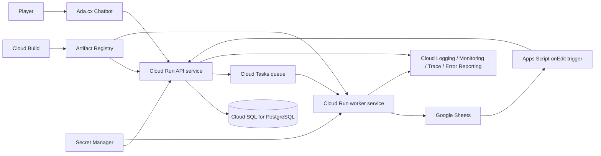

# Google Cloud Enterprise Migration Guide

## HITL Withdrawal Automation

This guide explains how to evolve the current FastAPI-based implementation into a Google Cloud architecture while keeping Google Sheets as the near-term review interface.

It is intentionally concise, specific to this repository, and suitable for both technical teams and business stakeholders.

## 1. Current Project Context

The current implementation already supports the core withdrawal workflow:

1. Ada.cx calls `POST /hitl/v1/request_review`.
2. FastAPI creates a durable session in SQLite.
3. The backend either:
     - queues a Google Sheets write, or
     - immediately links the new session to an existing blank-decision row for the same player.
4. A human reviewer works in Google Sheets.
5. Apps Script `onEdit` sends `POST /webhook` back to the backend.
6. Ada.cx polls `GET /hitl/v1/status/session/{session_id}` for the final result.

Current implementation facts that matter for migration:

- FastAPI is the public API layer.
- SQLite is both the session store and the durable review-job queue.
- Google Sheets is the reviewer UI.
- Apps Script is the final-decision callback bridge.
- The code already includes retry logic, concurrency limiting, duplicate-pending suppression, reconciliation cooldowns, and timing-safe webhook auth.

## 2. What Must Stay the Same

The migration should preserve the business flow, not redesign it.

Keep these behaviors:

- Google Sheets remains the reviewer surface in the near term.
- The review decision remains human-led.
- Ada.cx continues to call the backend directly rather than relying on customer-support handoffs.
- The public API contract stays stable:
    - `POST /hitl/v1/request_review`
    - `GET /hitl/v1/status/session/{session_id}`
    - `POST /webhook`
- Duplicate active review requests for the same player should still be suppressed.

After migration, Google Sheets should remain the review interface rather than the primary system of record.

## 3. Target Operating Model

Recommended principle:

- Cloud SQL becomes the source of truth.
- Cloud Tasks becomes the durable async layer.
- Cloud Run becomes the public compute layer.
- Google Sheets remains the human review interface.
- Apps Script remains a thin event-driven callback layer.

This preserves the existing workflow while moving reliability, recovery, and security into managed Google Cloud services.

## 4. Target Architecture

## 5. Recommended Google Cloud Services

### Core services

| Need | Recommended service | Why it fits this project |
| --- | --- | --- |
| Public API hosting | Cloud Run | Managed HTTPS, autoscaling, revision rollouts |
| Durable async processing | Cloud Tasks | Queueing, retries, rate limiting, idempotent delivery |
| System of record | Cloud SQL for PostgreSQL | Durable session state, auditability, reporting |
| Secret storage | Secret Manager | Removes `.env`/JSON-key runtime dependency |
| Container registry | Artifact Registry | Standard image storage for build/deploy |
| CI/CD | Cloud Build | Repeatable container builds and deployments |
| Observability | Cloud Logging, Monitoring, Error Reporting, Trace | Centralized operations and debugging |

### Optional but strong enterprise additions

| Service | Use when needed |
| --- | --- |
| Cloud Armor | Public WAF, IP controls, rate limiting |
| External HTTPS Load Balancer | Custom domain and centralized ingress |
| Cloud Scheduler | Archives, reconciliations, housekeeping |
| Cloud Run Jobs | Admin jobs, archival, scheduled maintenance |
| BigQuery | Audit and operational analytics |
| API Gateway or Apigee | If API management is already a company standard |
| Terraform | Repeatable infrastructure provisioning |

## 6. Current-to-Future Mapping

| Current repo component | Google Cloud target |
| --- | --- |
| Local FastAPI app | Cloud Run |
| `ngrok` tunnel | Cloud Run URL or custom domain |
| SQLite sessions + queue | Cloud SQL + Cloud Tasks |
| Local background workers | Cloud Tasks + Cloud Run worker handler |
| `.env` runtime secrets | Secret Manager |
| `service_account.json` file | Attached Cloud Run service account using ADC |
| Console logs | Cloud Logging + Error Reporting |
| Local health/metrics usage | Cloud Monitoring dashboards and alerts |
| Manual deploys | Cloud Build + Artifact Registry |
| Google Sheet as both UI and state | Google Sheet as UI only; Cloud SQL as source of truth |

## 7. Migration Phases

### Phase 1: Hosting and secret management

Goal: move from local hosting and tunnel-based exposure to managed cloud hosting.

Activities:

1. Create the Google Cloud project(s).
2. Enable required APIs.
3. Create Artifact Registry.
4. Add Cloud Build.
5. Deploy the API to Cloud Run.
6. Move runtime secrets to Secret Manager.
7. Replace disk-based credentials with Cloud Run service-account identity.

### Phase 2: Durable state and async control

Goal: remove dependence on local SQLite and in-process workers.

Activities:

1. Move sessions and audit state to Cloud SQL.
2. Replace local review-job execution with Cloud Tasks.
3. Make task handlers idempotent.
4. Keep the public API contract unchanged for Ada.cx.
5. Keep Google Sheets as the reviewer UI only.

### Phase 3: Observability and security

Goal: establish production-grade operational visibility and security controls.

Activities:

1. Structured logs in Cloud Logging.
2. Error Reporting and Trace integration.
3. Monitoring dashboards and alerts.
4. Secret access review.
5. Optional Cloud Armor and custom domain.

### Phase 4: Scale and operations

Goal: support larger traffic while still using Sheets.

Activities:

1. Tune Cloud Tasks queue rates.
2. Add sheet archival and sharding strategy.
3. Schedule housekeeping jobs.
4. Add reporting tables and analytics if needed.

## 8. Scale Constraints That Still Matter

Even after migration, the primary scale constraints remain Google Sheets usage patterns and reviewer capacity.

### Key limits to keep in mind

| Limit area | Practical takeaway |
| --- | --- |
| Sheets API read quota | Roughly `300/min/project` by default; do not make polling depend on Sheets |
| Sheets API write quota | Roughly `300/min/project` by default; smooth writes with Cloud Tasks |
| Apps Script execution | Keep Apps Script thin; use it only for final callbacks |
| Spreadsheet size | Active sheets should be archived or sharded over time |
| Human review throughput | Enterprise hosting improves platform resilience, but review capacity still depends on reviewer throughput |

### Architecture implication

- Ada.cx polling should read from Cloud SQL, not Google Sheets.
- Google Sheets should serve as the reviewer interface, while Cloud SQL holds the authoritative state.
- Cloud Tasks should protect Sheets from bursts.
- Archival strategy becomes mandatory as row volume grows.

## 9. Current Optimizations Already in This Repo

These current optimizations map cleanly to the managed-service patterns recommended for migration.

| Current optimization | File | Enterprise equivalent |
| --- | --- | --- |
| Thread-local Sheets client cache | `src/sheets_service.py` | ADC-authenticated Cloud Run service identity |
| Sheets concurrency limit | `src/sheets_service.py` | Cloud Tasks queue rate limiting |
| Duplicate-pending suppression | `src/main.py` + `src/sheets_service.py` | DB uniqueness and idempotent task handling |
| Reconciliation cooldown | `src/main.py` | Cloud SQL as source of truth; fewer sheet reads |
| SQLite WAL + tuned pragmas | `src/session_store.py` | Cloud SQL with managed HA and pooling |
| Durable local review queue | `src/session_store.py` | Cloud Tasks |
| Timing-safe webhook secret comparison | `src/main.py` | Cloud Armor, IAM, Secret Manager |

## 10. Security Model for Migration

Recommended baseline:

- Use Cloud Run service accounts with Application Default Credentials.
- Remove JSON key files from runtime.
- Store secrets in Secret Manager.
- Use least-privilege IAM.
- Enable Cloud Audit Logs.
- Add Cloud Armor if public ingress needs WAF or rate controls.

Recommended service-account split:

- API runtime service account
- Worker service account
- CI/CD deployer service account

## 11. Current-State Validation Checklist

Before presenting the migration plan to stakeholders:

1. Confirm the current end-to-end flow still works as expected.
2. Confirm duplicate-pending suppression works correctly.
3. Confirm `/health` and `/metrics` reflect live state.
4. Confirm Apps Script `onEdit` delivers webhook callbacks.
5. Confirm the same public API paths are the ones you plan to keep after migration.
6. Confirm the architecture clearly separates the reviewer interface from the authoritative data store.

## 12. Post-Migration Validation Checklist

1. Cloud Run responds on the production URL.
2. Ada.cx can call the request and status endpoints.
3. Apps Script can call the webhook endpoint.
4. Cloud SQL stores sessions and state transitions correctly.
5. Cloud Tasks retries and rate limits work as intended.
6. Sheets writes remain correct under load.
7. Monitoring dashboards and alerts work.
8. Secret access and deployment audit logs are visible.

## 13. Cost Guidance

For this project, the broad cost profile remains similar:

- Initial pilot stack: roughly low tens of dollars per month.
- Production-oriented stack with HA database, Cloud Armor, and fuller observability: roughly low hundreds of dollars per month.

The exact number depends on region, database size, logging volume, and Cloud Run traffic. Use Google Cloud pricing calculators before implementation approval.

## 14. Final Recommendation

For this repository and use case, the strongest near-term enterprise target is:

- Cloud Run for the API layer
- Cloud Tasks for async Sheets work
- Cloud SQL for durable state and auditability
- Secret Manager for secrets
- Artifact Registry and Cloud Build for delivery
- Cloud Logging, Monitoring, Trace, and Error Reporting for operations
- Google Sheets retained as the payment-agent review interface

That path preserves the current workflow, reduces local operational dependencies, and provides a clear progression from the current implementation to a production-ready Google Cloud deployment while building on the work already completed in this project.
